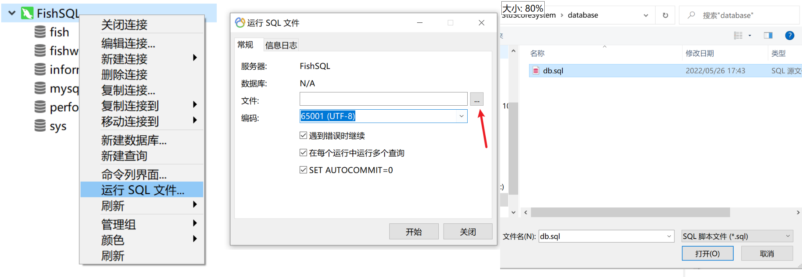
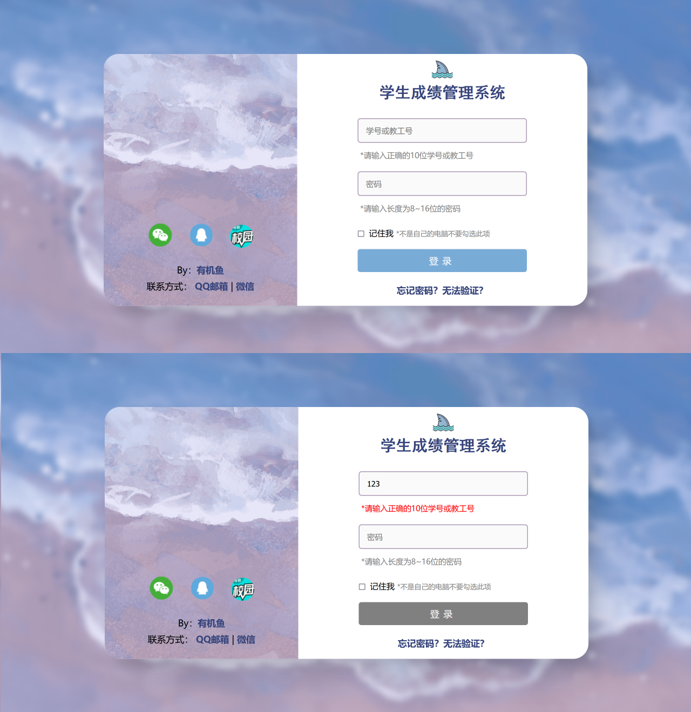
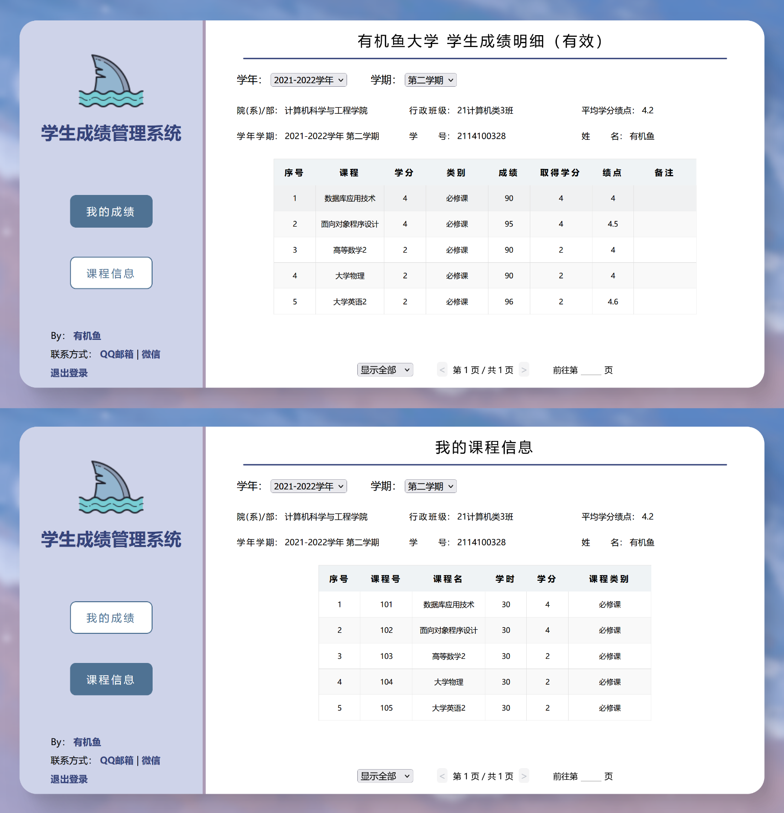
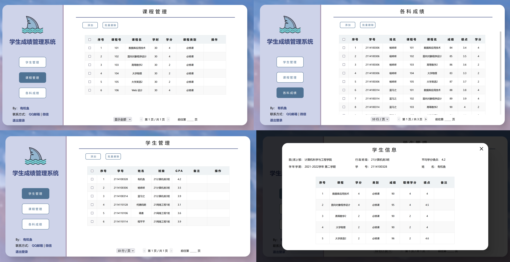

<h1 align="center">[PHP] 学生成绩管理系统</h1>

### 1 介绍

大一第二学期 “数据库应用技术” 期末大作业，纯原生 HTML5、CSS3、JavaScript、MySQL 与 PHP，还没用到其他框架。

虽然是**传统节目**了，但我还是想弄点新花样。在开发的过程中还是边写边查地面向谷歌编程...... 在功能设计与 js 的编写耗费了大量的时间，但还是写得挺粗糙的，继承方式很乱，也有很多肉眼可见的**飞线** \\doge。

### 2 使用方式

下载并解压后，将 [database/database.php](database/database.php) 中的 `$pw = 'fish';` 改为本地的 `MySQL` 密码，用 MySQL 工具将 [database/db.sql](database/db.sql) 数据库文件导入

并在 PHP 服务器 (如 [PHPStudy](https://www.xp.cn/download.html) 等) 或 IDE ([PHPStorm](https://www.jetbrains.com/phpstorm/download/#section=windows)) 打开并加载 [login.php](login.php) 并登陆即可

### 3 环境部署

#### 3.1 语言版本

- **PHP =>** 8.1.3
- **MySQL =>** 8.0.28

#### 3.2 账号登录

- 默认学生账号密码为 `2114100328`
- 教师账号： `teacheroot` | 密码： `fishroot`

> 因语言特性及没做兼容，尽量使用 MySQL8 吧

> 因为是用 `PDO` 连接的数据库，所以要先注意下是否启动了 PDO 拓展

> ~~什么？你问 IE？~~

#### 3.3 MySQL 配置

### 4 界面设计

#### 4.1 登陆界面

 

#### 4.2 学生界面

#### 4.3 教师界面

### 5 功能一览

- 登录界面使用 `form.onsubmit = ()=>{return false;}` 拦截提交动作，做一些简单的输入验证
- 在数据传输方面，主要使用 `Ajax` 向后端 PHP 发起请求，得到数据再插入，避免了大量的界面刷新
- 点击表头即可进行升降序
- 采用前端对表格分页（数据量上去的时候应该用 SQL 的 `limit` 进行分页才对）
- 教师界面中对学生详细信息的展示，使用了类似弹窗的功能，避免界面跳转
- 编辑学生详细信息时，点击数据即进入编辑模式(采用将 `innerHTML` 变为 `input` 输入框)。保存时使用 `Ajax` 发送 POST 请求，将打包成 JSON 的更改后的数据发送给后端，PHP 再将 POST 数据解码成数组，遍历并更改
- 添加了模糊搜索
- ...

### 6 数据库设计

#### 6.1 user 用户

| 列名      | 含义           | 类型            |
| :-------- | :------------- | :-------------- |
| id        | 序号           | int、主键、自增 |
| userName  | 用户名 \| 学号 | varchar(10)     |
| passWords | 密码           | varchar(20)     |
| power     | 权限，1 为教师 | boolean         |

#### 6.2 stuinfo

| 列名        | 含义     | 类型         |
| :---------- | :------- | :----------- |
| stuId       | 学号     | char(10)     |
| stuName     | 姓名     | varchar(255) |
| major       | 专业名   | varchar(255) |
| totalCredit | 总学分   | float        |
| GPA         | 平均绩点 | float        |
| comments    | 备注     | varchar(255) |

#### 6.3 course

| 列名       | 含义   | 类型         |
| :--------- | :----- | :----------- |
| courseId   | 课程号 | char(3)      |
| courseName | 课程名 | varchar(255) |
| learnTime  | 学时   | int          |
| credit     | 学分   | float        |
| type       | 类型   | varchar(255) |

#### 6.4 score

| 列名       | 含义     | 类型         |
| :--------- | :------- | :----------- |
| stuId      | 学号     | char(10)     |
| courseId   | 课程号   | char(3)      |
| scoreGot   | 所得成绩 | float        |
| creditGot  | 所得学分 | float        |
| gradePoint | 绩点     | float        |
| comments   | 备注     | varchar(255) |

### 7 结语

其实因为拉下好多科目的复习(期末嘛)，有点急着去完成，有一些功能就搁置下了。比如搜索的一些 bug、对输入信息的验证、下拉筛选信息、SQL 分页等等，以及一对惨不忍睹的飞线。

开发过程一直在磕绊，卡关几天是常有的，但最终还是两个多星期完成了它......还是好好复习期末吧 Orz

 

**来点 Counter**

Date : 2022-06-16 17:51:29

Directory StuScoreSystem\\

Total : 16 files, 2339 codes, 177 comments, 368 blanks, all 2884 lines

**Languages**

| language   | files | code | comment | blank | total |
| :--------- | ----: | ---: | ------: | ----: | ----: |
| JavaScript |     4 |  715 |      99 |   112 |   926 |
| CSS        |     4 |  679 |      27 |    84 |   790 |
| PHP        |     6 |  677 |      26 |   101 |   804 |
| SQL        |     1 |  183 |      25 |    26 |   234 |
| Markdown   |     1 |   85 |       0 |    45 |   130 |
